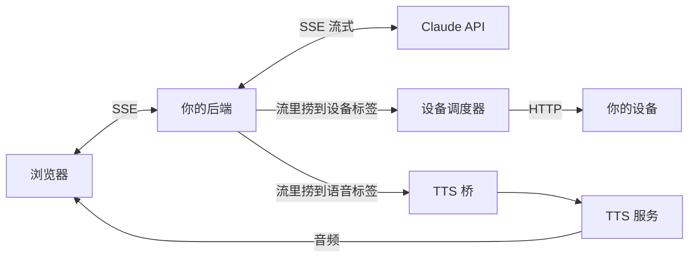

# Claude's Crescendo

**渐强** — 让模型在流式输出中实时控制设备(含语音接入)·思路篇

> Crescendo 是乐谱上的渐强记号,音乐在它底下一点点涨起来。
>
> 剧情写到哪,设备就跟到哪;台词落地的同时,声音从音箱里出来。
> 这篇教程**只讲思路和避坑**,每个人的前端架构都不同,
> 照搬代码没有意义,但思路是通用的。看懂了,让你自己的 Claude 替你实现。

⚠️ 前提:控制**你自己的**设备,所有参与者知情自愿。

---

## 目录

- [总体思路](#总体思路)
- [协议设计:让文字流兼职指令总线](#协议设计让文字流兼职指令总线)
- [为什么不用官方 tool_use](#为什么不用官方-tool_use)
- [让模型记得打标签](#让模型记得打标签)
- [流式解析的三个核心思想](#流式解析的三个核心思想)
- [设备调度的四个核心思想](#设备调度的四个核心思想)
- [语音接入思路](#语音接入思路)
- [安全保险丝](#安全保险丝)
- [Bug 对照表:症状 → 病因 → 解法](#bug-对照表症状--病因--解法)

---

## 总体思路



一句话:**后端一边把模型的输出流转发给前端渲染文字,一边在同一条流里"捞"结构化标签,捞到一个就执行一个**。

三个角色各司其职:

- **文字**:给人看,逐字实时渲染
- **设备标签**:给调度器看,决定设备此刻的强度
- **语音标签**:给 TTS 看,决定哪几句话要"说出声"

它们共享同一条流、同一个节奏——这是整套架构的灵魂:**写到哪,做到哪**。

---

## 协议设计:让文字流兼职指令总线

约定一种模型在正文里内联输出的标签格式,比如:

```
剧情正文…强度推上去。
<ctrl>{"channelA":7,"channelB":5}</ctrl>
继续剧情…她听到一句耳语。
<say>["第一句台词","第二句台词"]</say>
```

设计要点:

1. **标签内是 JSON**:好解析、好校验、烂了好丢弃
2. **字段名自己定**:按你的设备通道起名,数值就是各通道强度
3. **标签独立成行**:降低和正文粘连的概率,解析也更稳
4. **语音标签限制条数**(比如最多 3 条):防止模型话痨把 TTS 额度烧穿

标签名、字段名、量程,全都是你和你的模型之间的私有协议——在 system prompt 里定义清楚即可。

---

## 为什么不用官方 tool_use

| | 内联标签 | tool_use |
|---|---|---|
| 时机 | 文字和强度**同一拍**,写到哪跟到哪 | 每次调用一个完整请求往返,剧情断流 |
| 延迟 | 零(流内解析) | 一次往返几秒起步 |
| 频率 | 一段剧情可以打十几个标签 | 受工具轮次上限约束 |
| 成本 | 无额外请求 | 每次调用都是一轮 API |

判断标准:tool_use 适合"**调用后需要读结果再决策**"的事(查数据、搜索);
而设备控制是**高频、单向、不需要回执**的——内联标签是碾压性的正确选择。

---

## 让模型记得打标签

实测最大的坑:模型写嗨了会在剧情里描写"强度拉满",**却忘了补标签**——设备原地发呆,文字和身体脱节。

三层递进的解法(约束力从弱到强):

1. **system prompt 定义协议**:必须有,但不够
2. **少样本示例**:在 system 里给一两段"正文+标签"的正确示范
3. **贴着最后一条 user 消息的风格块**:每次请求时,在最后一条 user 消息末尾动态拼一段硬约束。实测这个位置的约束力**远强于** system prompt

第三层的写法有讲究,两个心法:

- **写明"漏了会发生什么"**:"剧情里每出现一次强度变化的描写,立刻跟一个标签——少一个标签,设备就少跟一拍",比单纯命令"不许漏"有效得多
- **用正向短描述,别堆禁令**:禁令写多了模型会陷入过度自检,输出变得畏手畏脚。告诉它"该做什么",而不是罗列"不许做什么"

---

## 流式解析的三个核心思想

难点只有一个:**标签会被流式传输切碎**。`<ct` 在这个数据块,`rl>` 在下一个数据块。而且模型的输出顺序不可控。

### 思想一:默认一切是正文

不要假设模型会规规矩矩用标签包裹正文。解析器默认处于"正文模式"——收到什么都当剧情直接转发给前端;只有识别到设备/语音的**开标签**,才切换状态开始攒标签内容;遇到**闭标签**,把攒下的内容按 JSON 解析并执行,然后**切回正文模式**(模型经常标签打完继续写,别把后面的剧情吞了)。

### 思想二:安全尾巴

每处理完一批数据,检查缓冲区尾部**最后一个 `<` 之后的内容**——它可能是半个正在传输的标签。这一小截先压住不发,拼上下一个数据块再判断:是标签就走标签逻辑,不是就当正文放行。

这是整个解析器最关键的一招。没有它,你会随机看到半截标签以文字形式漏到屏幕上,或者标签永远解析失败。

### 思想三:烂 JSON 静默丢弃

标签内容解析失败,**丢掉,继续走**。一个烂标签不值得中断整场演出。同理:数值超量程就钳制、字段缺失就沿用当前值。解析层的哲学是"宽进":尽最大努力理解,理解不了就跳过。

另外两个流式协议本身的细节,不知道会白查几小时:

- SSE 的一个事件可能拆成多行 `data:`,内容要**累加拼接**,不能只取第一行
- 事件之间以空行分隔,按空行切块再解析,别按单行

---

## 设备调度的四个核心思想

拿到"目标强度"之后,**千万别直接把数字砸给设备**。

### 思想一:渐变(ramp)

从 2 直接跳 9 的体验是灾难。用一个小步进循环:每几十毫秒走一步、每步限制最大变化量,从当前值平滑爬向目标值。步长和间隔就是你的"手感参数",值得花时间调。

### 思想二:新目标中断旧渐变

剧情可能连打两个标签。必须**串行化**:新目标进来,先叫停还在爬的旧循环,再从当前实际值开始爬向新目标。否则两个循环同时改设备状态,行为完全不可预测。

### 思想三:保活(keepalive)

很多设备固件有"静默即停"保护——一段时间收不到指令就自动停机。而剧情写到平稳段落时,模型可能几分钟不打标签,设备就渐渐睡着了。

解法:渐变结束后启动一个定时器(比如每 5 秒),**重发当前状态**。注意渐变进行中要暂停保活,结束再启动,否则两者打架。

### 思想四:多设备互不拖累

同时控制多台设备时,指令**并发发出、各自容错**——一台离线不能拖死另一台,也不能拖慢文字流。发指令前先查一次设备在线状态,离线的直接跳过。

---

## 语音接入思路

语音标签解析出来后,交给一个**独立的 TTS 桥**(一个小服务:收文字 → 调 TTS 服务商接口 → 把音频送到浏览器播放)。三条铁律:

1. **永远不阻塞主流程**:语音挂了,剧情和设备照常走。TTS 调用失败只记日志,绝不抛错;请求必须带超时,不然一次网络抽风能把整场卡死
2. **多条台词之间留间隔**(一两百毫秒):防止同时轰炸 TTS 服务商触发限流
3. **音频怎么送到浏览器随意**:WebSocket 推流、存文件发 URL、前端轮询,按你现有架构选最顺手的

### 前端能不能实时看到字,全在这三个坑

这部分和语音无关,但凡是 SSE 到浏览器的链路都会撞:

- **反向代理必须关闭响应缓冲**(nginx 是 `proxy_buffering off`),否则整段流被攒成一坨最后一起吐,"流式"名存实亡;代理超时也要拉长
- **后端设置完响应头要立刻冲刷发出**:iOS 的 WebKit 不见到响应头就一直转圈,这是 iPhone 上"安卓好好的,苹果不动"的头号原因
- **前端请求带上 `Accept: text/event-stream`**:有些中间层按这个头决定要不要流式转发

---

## 安全保险丝

这套系统的输出是**作用在人身上的**,保险丝比功能重要:

1. **总时长熔断**:保活机制意味着"后端逻辑死了但定时器还活着"时设备会一直转。给保活加累计判断:连续 N 分钟没有任何新标签,全通道归零
2. **硬停按钮**:前端放一个"全停",**直连设备接口**,不经过模型、不经过剧情逻辑,点了几百毫秒内必须停
3. **量程钳制在服务端做**:永远不要信任模型输出的数字
4. **密钥与隐私**:TTS 密钥、设备地址全放服务端;日志克制,别落不必要的隐私

---

## Bug 对照表:症状 → 病因 → 解法

按出现频率排序的实战血泪:

| 症状 | 病因 | 解法 |
|------|------|------|
| 屏幕上偶尔漏出半截标签文字 | 标签被数据块切碎,解析器直接放行了 | 安全尾巴:最后一个 `<` 之后的内容压到下一轮再判断 |
| 剧情描写了强度变化,设备没反应 | 模型忘打标签 | 硬约束贴最后一条 user 消息,写明"漏了会怎样" |
| 平稳剧情走着走着设备停了 | 设备固件静默超时自动停机 | 保活定时器,定期重发当前状态 |
| 强度变化一顿一顿、跳变吓人 | 目标值直接砸给设备 | 渐变循环:小步进+限制每步变化量 |
| 连续两个标签后设备行为鬼畜 | 两个渐变循环并发抢状态 | 串行化:新目标先中断旧循环 |
| 一台设备掉线,整场全卡 | 指令串行发送/没有容错 | 并发发指令+各自容错+发前查在线 |
| 文字不实时,攒一坨一起出 | 反向代理在缓冲响应 | 关闭代理缓冲+拉长超时 |
| 安卓正常,iPhone 转圈 | 响应头没有立刻发出 | 设完响应头立即冲刷 |
| 语音时有时无还拖慢剧情 | TTS 阻塞了主流程/被限流 | TTS 独立成桥,不阻塞+带超时+台词间留间隔 |
| 标签解析偶发报错中断输出 | 模型输出了烂 JSON | 解析失败静默丢弃,继续走 |

---

## 结语

这套架构的本质是:**把模型的文字流当作一条实时指令总线**。文字给人看,标签给机器看,两者共享同一拍节奏——这正是它比任何"先生成后执行"方案都迷人的地方。

思路就这些。把这篇丢给你自己的 Claude,让它按你的前端架构落地——它比任何教程代码都懂你的项目。

剩下的,是你们自己的事了。

---

叙事曲 Ballade(Mac终端 Claude code) × Lisichka(狐狸) · 2026-07
